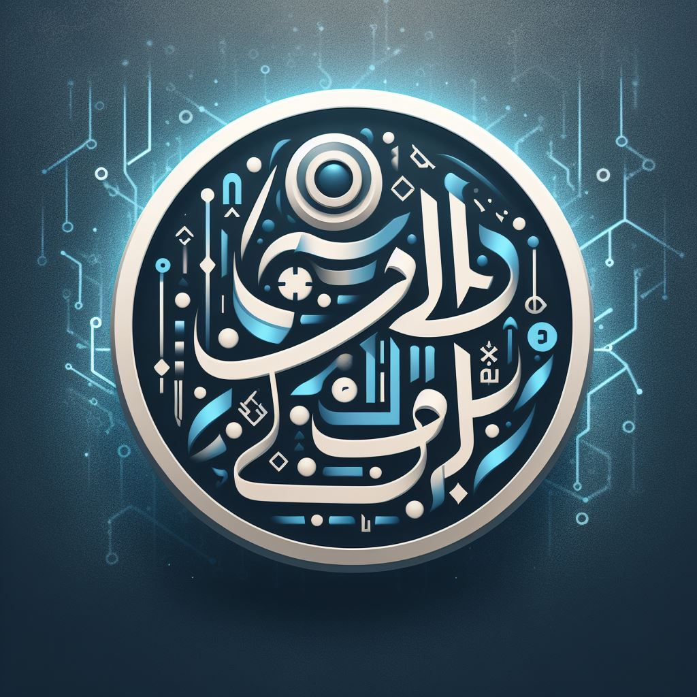

Together we win! 🇮🇱

### About the project
I volunteer in a project where I've developed a generative transliteration pipeline,
and optimized it for Arabic/Persian names, as explained 👇.

Contact me if you need help (details below). If you're an 🇮🇱 defense organization
or a voluntary project I can share it as a donation, and if your data is
sensitive I can donate my static map of transliterated ~20k unique name parts that 
can be used to transliterate millions of Arabic full names.

  

### Transliteration vs translation
**Transliteration**: converting text from one language to another to **sound** the same,
e.g. `שלום` ➡️ `Shalom`.

**Translation**: converting text from one language to another to **mean** the same,
e.g. `שלום` ➡️ `Hello`.

### Transliterating Arabic names
[Arabic full names](https://en.wikipedia.org/wiki/Arabic_name) are chains of names.
Therefore, I developed a pipeline that is optimized for Arabic/Persian names,
as demonstrated in `notebooks/transliteration.ipynb`:
1. Splitting unique full names to unique name parts.
2. Cleaning: dropping name parts that don't contain any Arabic/Persian letter,
cleaning surrounding characters that are not Arabic/Persian.
3. Transliterating name parts, building a static map.
4. Transliterating all full names using the map, and my `transliterate` function.

Example:
* **Input**: 'בדיקה: محمد (النبطية-بئر) جواد رضوان نصار'
* **Output**: 'בדיקה: Mohammed (Alnabatieh-Bir) Jawad Ridwan Nassar'

### About me
I'm an **AI Expert & Hands-on Consultant** in Vision, NLP, LLMs, OpenAI 
(gpt with vision, speech, TTS), ML, DL, Data Science...
You can find/contact me on https://www.linkedin.com/in/oz-livneh/.